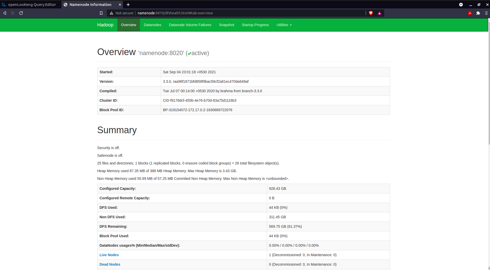
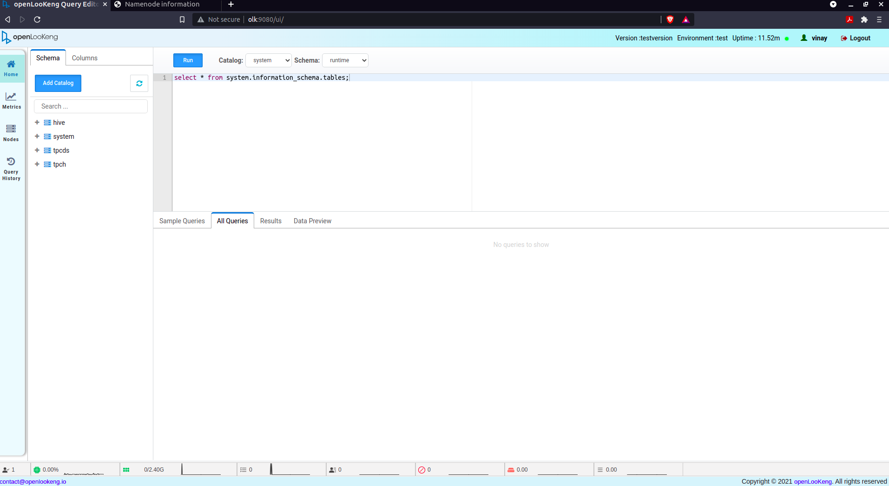

# Overview
This module provides docker-compose based hive and hadoop services for local dev environment.
There are two modes of starting these services.
1. **Isolated service mode** : In this mode each of the process runs in its own container. Ex: Namenode(single), DataNode(scalable), Derby(Single), Hive (Single). If required individual service can be re-configured/re-built/re-launched. This mode is enabled by default.
2. **Embeded container mode** : In this mode all above servies will be embeded into a single container. Embeded mode can be enabled by configuring `EMBED_IN_SINGLE_CONTAINER=true` in `config` file.

# Pre Requisites
1. Docker 
2. Docker compose

# How to configure, build and start
## Configuration
1. Configure the components' version and package details in `config` as shown below.
```
export HADOOP_VERSION=3.3.0
export HADOOP_PACKAGE=/home/vinay/releases/hadoop-$HADOOP_VERSION/hadoop-$HADOOP_VERSION-RC0.tar.gz

export DERBY_VERSION=10.10.2.0
export DERBY_PACKAGE=/home/vinay/releases/db-derby-$DERBY_VERSION-bin.tar.gz

export HIVE_VERSION=3.1.2
export HIVE_PACKAGE=/home/vinay/releases/apache-hive-$HIVE_VERSION-bin.tar.gz

export OLK_VERSION=1.4.0-SNAPSHOT
export OLK_PACKAGE=/home/vinay/releases/hetu-server-$OLK_VERSION.tar.gz

```
2. By default, current user's name  and group details will be used as service user for all services. if required to change this, can be configured as below.
```
export USER_NAME=${USER}
export USER_ID=$(id -u "${USER_NAME}")
export GROUP_ID=$(id -g "${USER_NAME}")

```
3. If required to run in **Embeded container mode** for Hadoop/Hive services, set the below configuration to `true`. Else keep default value of `false` for **Isolated service mode**.
```
export EMBED_IN_SINGLE_CONTAINER=false
```

4. If needs to build and start OLK service set the below config to `true`
```
export OLK_ENABLED=true
```
## Build

1. Build all components' containers by executing below command.
    ```
    bash ./build.sh
    ```

## Start
1. Create the following docker network if not already available. (One time only)
    ```
    docker network create hadoop.com
    ```

2. Execute the below command to start the services
    ```
    bash ./compose-wrapper up -d
    ```

## Status/Troubleshooting
1. Use below command to check the status of services.
    ```
    bash ./compose-wrapper ps
    ```

2. Use below command to check logs of start-up commands.
    ```
    bash ./compose-wrapper logs
    ```

3. Use below command to login to any of the container to check some logs (more helpful in embeded container mode, as HDFS logs are not available on `./compose-wrapper logs`).

    ```
    bash ./compose-wrapper exec hive-hadoop /bin/bash
    ```

4. UIs of services such as HDFS NameNode and OLK can be accessed using `localhost:9870` and `localhost:9080` respectively, because 9870 and 9080 local ports are mapped with namenode and OLKs http ports.


5. Even without local mapping all ports of each service can be accessed directlt using the particular container's IP from host machine. IP of each container can be found using `docker inspect` command, and /etc/hosts mapping can be added in host machine to resolve hostnames.

    Ex: In case of isolated containers, there will be separate containers for for each of the service.
    ```
    $ ./compose-wrapper ps
             Name                           Command              State                                        Ports                                      
    ---------------------------------------------------------------------------------------------------------------------------------------------------------
    derby                            startNetworkServer -h 0.0.0.0   Up      1527/tcp, 22/tcp                                                                
    hive                             initAndStartMetastore.sh        Up      10000/tcp, 10001/tcp, 22/tcp, 9820/tcp, 9864/tcp, 9866/tcp, 9867/tcp, 9870/tcp  
    namenode                         hdfs namenode                   Up      22/tcp, 9820/tcp, 9864/tcp, 9866/tcp, 9867/tcp, 0.0.0.0:9870->9870/tcp          
    non-security-non-ha_datanode_1   hdfs datanode                   Up      22/tcp, 9820/tcp, 9864/tcp, 9866/tcp, 9867/tcp, 9870/tcp                        
    olk                              launcher run                    Up      22/tcp, 0.0.0.0:9080->9080/tcp, 9820/tcp, 9864/tcp, 9866/tcp, 9867/tcp, 9870/tcp

    ```
    Find out the IP of `namenode` container as below.
    ```
    $ docker inspect namenode | grep "IPAddress"
            "SecondaryIPAddresses": null,
            "IPAddress": "",
                    "IPAddress": "172.24.0.2",

    ```
    Similarly find out IPs for all other containers, if any and add the ip-hostname mapping in /etc/hosts in host machine as below.
    ```
    $ cat /etc/hosts

    127.0.0.1	localhost

    # The following lines are desirable for IPv6 capable hosts
    ::1     ip6-localhost ip6-loopback
    fe00::0 ip6-localnet
    ff00::0 ip6-mcastprefix
    ff02::1 ip6-allnodes
    ff02::2 ip6-allrouters

    172.24.0.2 namenode
    172.24.0.3 datanode
    172.24.0.4 derby
    172.24.0.5 hive

    ```

    Now can access the same Namenode and OLK UI using their own hostnames.

    Namenode UI:
    
    OLK UI:
    

